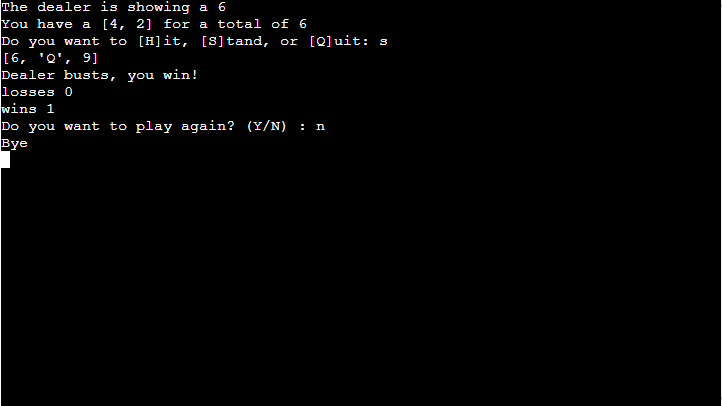
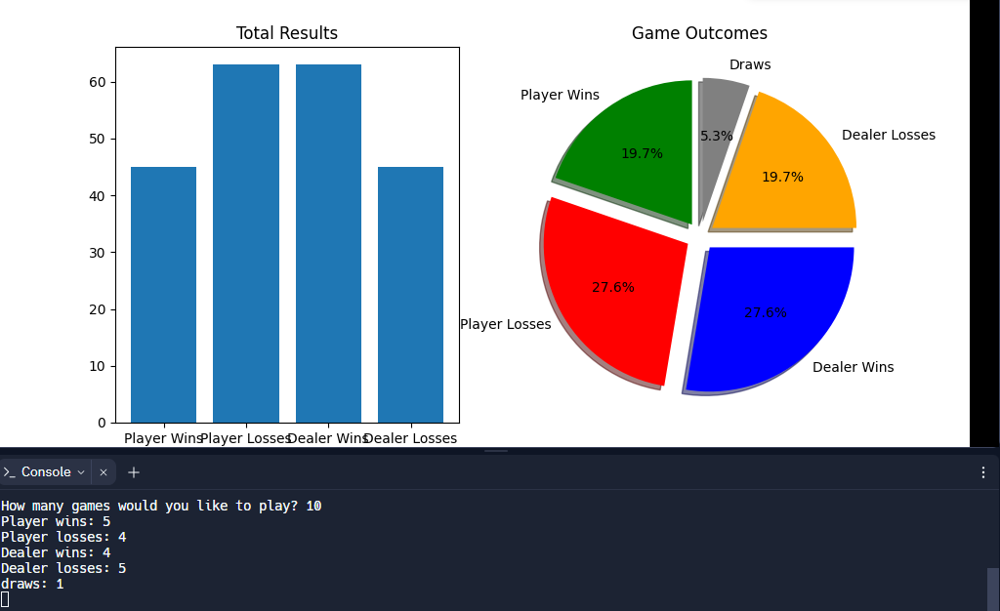

# BlackJack
The Blackjack Python Code project is a simulation of the broadly-loved casino card sport, frequently known as 21. Designed to run in a console interface, this program offers an immersive enjoy between a consumer-participant and an automated provider. utilising a deck of 52 cards, which embody the traditional 4 fits and values ranging from Ace to King, the game's objective is for the player to accumulate a hand cost near 21 without surpassing it. through this intuitive interface, players can decide to 'Hit' and draw an extra card, 'Stand' to keep their cutting-edge hand, or 'give up' to exit the game. but, the project lies in the sport's logic: if the participant's general card value exceeds 21, they 'bust' or lose the sport. An added twist is the power of the Ace card, which can be counted as both 1 or 11 primarily based on the player's strategic desire.

# Planning
## User wants
- As a user, I want to be able to play the game multiple times
- As a user, I want there to be different modes for more unique gameplay
- As a user, I want to know my losses and wins 

## My Goals
- Users to play multiple times 
- Users see BlackJack is rigged through autonmous 

## Features used to achieve this goal
- Validated inputs 
- 2 different game modes
- Record game wins and losses 
- autonmous allows for as many games as the user wants 
- Hit, Stand or Quit option 
- Asking the user if they would like to play again

# Design 
- The Blackjack Python Project offers a refined simulation of the classic casino game, focusing on capturing and analyzing win-loss data for players and the dealer. Users can choose between two game modes: Player vs. Dealer for interactive gameplay, and Autonomous for data collection. The game's unpredictability is maintained with random card draws, while structured input validation ensures smooth user interaction. Gameplay outcomes are stored in a CSV file, facilitating the creation of insightful visualizations, such as pie and bar charts.

- To optimize user experience, game modes are streamlined. In the active mode, after viewing the dealer's and player's hands, players decide to 'Hit' or 'Stand'. Surpassing a hand value of 21 results in a bust. In Autonomous mode, the number of automated rounds is predetermined for efficient data gathering. The game logic excludes face cards for simplification, and post-game, the hands are compared to declare a winner.

# Features
-  My first major feature are the inputs. every enter is carefully checked to be validated, guiding the person from one set off to the subsequent. Upon reaching the final prompt, users can pick out to either give up the game or have interaction in autonomous play. i've ensured compatibility with both uppercase and lowercase inputs for person convenience. If a user opts to play with the aid of typing 'Y', they will then be directed to select their preferred sport mode.

- When a user engages in the Player vs Computer , only one of the dealer's cards and the player's hand will be displayed. Players will have the options to 'Hit', 'Stand', or 'Quit', each with its own set of rules:
'Hit' means drawing additional cards. If your total surpasses 21, it's considered a 'bust', leading to an immediate loss and an addition of one to your loss tally.
'Stand' means you're satisfied with your cards and choose to compare them with the dealer's to determine the winner.
'Quit' simply ends the game.
Once the round concludes, whether you've won or lost, you'll be presented with an option to play another round.

-  When the user plays autonmoous they will be given the input option of how many games they wanna see played, after they are played it will show all the wins losses and draws of both sides along side the barchart and pichart of the data (Only can be seen on the Replit IDE as it has an output that shows the images I will showcase them below, I didnt use replit as my IDE as i needed to use codeanywhere or gitpod)

# Features left to implement 
- I would like to add a player versus player which i did have but there were too many bugs that i believe i couldnt finish the code in time so i simplied it to only have 2 game modes. 
- I would like to have added a currency 
- I would have wanted to create an output system that showcased the graph data but thats beyond my programming capabilities as of now

# Testing 
- I deliberately made an attempt to test frequently while developing also using the input of fellow colleagues. Despite my diligence, I did run into a few problems. I investigated each error's characteristics to better understand why the code behaved in an unexpected way whenever one was found. This method allowed me to investigate additional approaches and troubleshoot the issue until I was satisfied that it had been solved. However, testing the code contained flaws due to single line errors that prevented the code from continuing, such as when I included an exit() after an input. Although the code still functioned as a whole, it didn't perform as I had intended, so I had to check and double-check each line of code as I went along. During my testing, I also came across a problem with the blackjack game itself. In particular, there is a large advantage for the dealer and a higher likelihood of draws as a result of the game's regulations.The rules state that dealers can't hit until they have a hand value of 17, but my implementation stopped hitting at 18, increasing the likelihood that the player would lose and the frequency of draws. This effectively eliminated the idea that blackjack was a fair game and forced me to code a rigged game, but it served as a benefit for my hypothesis to start exploring whether blackjack is rigged as evidenced by this data of 100 games run.

-  I began to unit test my validated inputs to individually and independently scrutinise for proper operation.I focused on player versus computers validated input to test if my if statements allowed for the y or n to be the only acceptable answer, I also wanted to showcase as a test table of the multiple different data types while I tested. 

- Validator

## Deploy Heroku 
In order to deploy the app on Heroku, an account is required. The steps for the deyploment are as follows:

1 Click "New" and "Create new App" from the menu at right top
2 Insert an app name and select a region. Click "Create App"
3 Select the "GitHub" deployment method
4 Search for a repository to connect and a branch to deploy
5 In the "Setting" tab, go to the section "Buildpacks" and add two buildpacks in the following order :
- heroku/python
- heroku/nodejs
6 Deploy branch, wait for everything to load then press view button 

# Credits

## Content
- Real Python: Comprehensive various Python topics.
  [https://realpython.com/]

- Geeks for Geeks : tutorials related to Python.
  [https://www.geeksforgeeks.org/python-programming-language/]

- Python-course.eu: Detailed Python tutorials and examples.
  [https://www.python-course.eu/]

- TutorialsPoint 
  [https://www.tutorialspoint.com/python/index.htm]
  
- Matplotlib Documentation: Used for understanding data visualization components.
  [https://matplotlib.org/]
  
## Media

- Card Game Rules: Referenced official rules as defined by relevant card game authorities or websites.
  [https://bicyclecards.com/how-to-play/blackjack/]

- ASCII Art 
  [https://ascii.co.uk/art/blackjack]